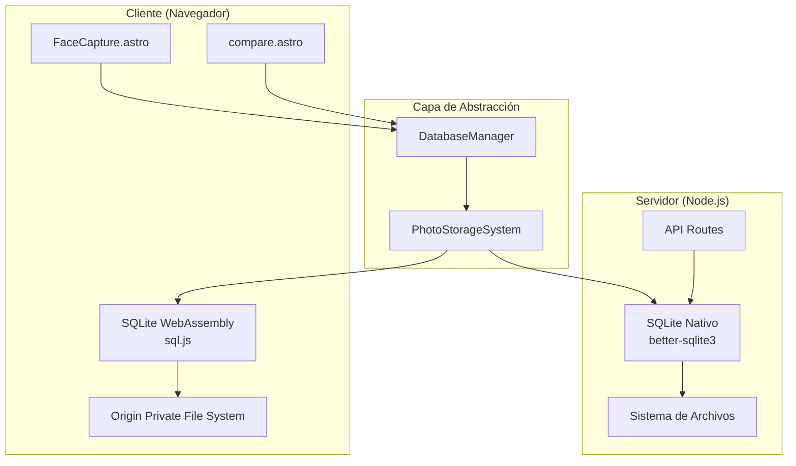

# Documento de Diseño Técnico

## Introducción

Este documento describe el diseño técnico para implementar el almacenamiento persistente de fotos faciales en SQLite local, reemplazando la dependencia actual de Supabase. La solución proporciona una arquitectura híbrida que funciona tanto en el servidor (Node.js) como en el cliente (navegador) utilizando tecnologías modernas de WebAssembly.

## Resumen Ejecutivo

La funcionalidad de almacenamiento SQLite permitirá a la aplicación Astro guardar y recuperar fotos faciales de manera persistente sin depender de servicios externos. El diseño implementa una arquitectura dual que utiliza `better-sqlite3` en el servidor para máximo rendimiento y `sql.js` (WebAssembly) en el cliente para compatibilidad universal.

## Objetivos del Diseño

- **Independencia**: Eliminar completamente la dependencia de Supabase
- **Rendimiento**: Operaciones de base de datos sub-100ms para inserción y sub-200ms para consultas
- **Compatibilidad**: Funcionar tanto en entornos servidor como cliente
- **Simplicidad**: Mantener la misma API que la implementación Supabase existente
- **Persistencia**: Almacenamiento local confiable con integridad de datos

## Arquitectura

### Visión General



### Componentes Principales

#### 1. DatabaseManager
- **Propósito**: Capa de abstracción que detecta el entorno de ejecución
- **Responsabilidades**:
  - Detectar si se ejecuta en servidor o cliente
  - Inicializar el motor SQLite apropiado
  - Proporcionar API unificada para operaciones de base de datos

#### 2. PhotoStorageSystem
- **Propósito**: Lógica de negocio para gestión de fotos y personas
- **Responsabilidades**:
  - Operaciones CRUD para personas y fotos
  - Validación de datos
  - Manejo de errores
  - Conversión de formatos de imagen

#### 3. SQLiteServerAdapter (better-sqlite3)
- **Propósito**: Implementación de alto rendimiento para entorno servidor
- **Características**:
  - API síncrona para mejor rendimiento
  - Soporte completo de transacciones
  - Acceso directo al sistema de archivos

#### 4. SQLiteClientAdapter (sql.js)
- **Propósito**: Implementación WebAssembly para navegador
- **Características**:
  - Persistencia mediante OPFS (Origin Private File System)
  - Compatibilidad universal con navegadores modernos
  - Carga asíncrona del motor WebAssembly

## Componentes y Interfaces

### Esquema de Base de Datos

```sql
-- Tabla de personas
CREATE TABLE people (
    id INTEGER PRIMARY KEY AUTOINCREMENT,
    name TEXT NOT NULL,
    created_at DATETIME DEFAULT CURRENT_TIMESTAMP
);

-- Tabla de fotos faciales
CREATE TABLE face_photos (
    id INTEGER PRIMARY KEY AUTOINCREMENT,
    person_id INTEGER NOT NULL,
    photo_data TEXT NOT NULL, -- Base64 encoded image
    captured_at DATETIME DEFAULT CURRENT_TIMESTAMP,
    FOREIGN KEY (person_id) REFERENCES people(id) ON DELETE CASCADE
);

-- Índices para optimización
CREATE INDEX idx_face_photos_person_id ON face_photos(person_id);
CREATE INDEX idx_face_photos_captured_at ON face_photos(captured_at DESC);
CREATE INDEX idx_people_name ON people(name);
```

### Interfaces TypeScript

```typescript
// Tipos de datos principales
interface Person {
  id: number;
  name: string;
  created_at: string;
}

interface FacePhoto {
  id: number;
  person_id: number;
  photo_data: string; // Base64 encoded
  captured_at: string;
}

// Interfaz del adaptador de base de datos
interface DatabaseAdapter {
  initialize(): Promise<void>;
  close(): Promise<void>;
  
  // Operaciones de personas
  createPerson(name: string): Promise<Person>;
  getPersonById(id: number): Promise<Person | null>;
  getAllPeople(): Promise<Person[]>;
  
  // Operaciones de fotos
  createFacePhoto(personId: number, photoData: string): Promise<FacePhoto>;
  getFacePhotosByPersonId(personId: number): Promise<FacePhoto[]>;
  getAllFacePhotos(): Promise<FacePhoto[]>;
  deleteFacePhoto(id: number): Promise<boolean>;
}

// Interfaz del sistema de almacenamiento
interface PhotoStorageSystem {
  // Métodos compatibles con Supabase
  from(table: 'people' | 'face_photos'): QueryBuilder;
}

interface QueryBuilder {
  select(columns?: string): QueryBuilder;
  insert(data: any): Promise<{ data: any; error: any }>;
  update(data: any): Promise<{ data: any; error: any }>;
  delete(): Promise<{ data: any; error: any }>;
  eq(column: string, value: any): QueryBuilder;
  order(column: string, options?: { ascending?: boolean }): QueryBuilder;
}
```

### Configuración de SQLite

```typescript
// Configuración optimizada para ambos entornos
const SQLITE_CONFIG = {
  server: {
    // better-sqlite3 options
    readonly: false,
    fileMustExist: false,
    timeout: 5000,
    verbose: process.env.NODE_ENV === 'development' ? console.log : undefined,
  },
  client: {
    // sql.js options
    locateFile: (file: string) => `https://sql.js.org/dist/${file}`,
    wasmBinary: undefined, // Auto-load
  },
  pragmas: [
    'PRAGMA foreign_keys = ON',
    'PRAGMA journal_mode = WAL',
    'PRAGMA synchronous = NORMAL',
    'PRAGMA cache_size = 1000',
    'PRAGMA temp_store = MEMORY',
    'PRAGMA encoding = "UTF-8"',
  ],
};
```

## Modelos de Datos

### Modelo de Persona

```typescript
class PersonModel {
  constructor(
    public id: number,
    public name: string,
    public created_at: Date
  ) {}
  
  static fromRow(row: any): PersonModel {
    return new PersonModel(
      row.id,
      row.name,
      new Date(row.created_at)
    );
  }
  
  validate(): string[] {
    const errors: string[] = [];
    
    if (!this.name || this.name.trim().length === 0) {
      errors.push('El nombre es requerido');
    }
    
    if (this.name && this.name.trim().length > 100) {
      errors.push('El nombre no puede exceder 100 caracteres');
    }
    
    return errors;
  }
}
```

### Modelo de Foto Facial

```typescript
class FacePhotoModel {
  constructor(
    public id: number,
    public person_id: number,
    public photo_data: string,
    public captured_at: Date
  ) {}
  
  static fromRow(row: any): FacePhotoModel {
    return new FacePhotoModel(
      row.id,
      row.person_id,
      row.photo_data,
      new Date(row.captured_at)
    );
  }
  
  validate(): string[] {
    const errors: string[] = [];
    
    if (!this.person_id || this.person_id <= 0) {
      errors.push('ID de persona inválido');
    }
    
    if (!this.photo_data || !this.isValidBase64()) {
      errors.push('Datos de imagen inválidos');
    }
    
    if (this.photo_data && this.photo_data.length > 10 * 1024 * 1024) {
      errors.push('La imagen es demasiado grande (máximo 10MB)');
    }
    
    return errors;
  }
  
  private isValidBase64(): boolean {
    try {
      return btoa(atob(this.photo_data.split(',')[1] || '')) === (this.photo_data.split(',')[1] || '');
    } catch {
      return false;
    }
  }
  
  getImageSize(): number {
    const base64Data = this.photo_data.split(',')[1] || '';
    return Math.ceil(base64Data.length * 0.75); // Aproximación del tamaño en bytes
  }
}
```

## Correctness Properties

*Una propiedad es una característica o comportamiento que debe mantenerse verdadero a través de todas las ejecuciones válidas de un sistema—esencialmente, una declaración formal sobre lo que el sistema debe hacer. Las propiedades sirven como puente entre especificaciones legibles por humanos y garantías de corrección verificables por máquinas.*

Antes de definir las propiedades de corrección, realizaré un análisis de prework para determinar qué criterios de aceptación son testables como propiedades.

### Property 1: Integridad del Esquema de Base de Datos

*Para cualquier* estado de base de datos existente, la validación de integridad del esquema debe verificar correctamente la presencia y estructura de todas las tablas, índices y relaciones requeridas.

**Validates: Requirements 1.5**

### Property 2: Unicidad de Identificadores

*Para cualquier* secuencia de operaciones de creación (personas o fotos), todos los IDs generados deben ser únicos dentro de su respectiva tabla.

**Validates: Requirements 2.2**

### Property 3: Validación Universal de Entrada

*Para cualquier* dato de entrada (nombres de persona, datos de imagen), el sistema debe validar correctamente los datos según los criterios establecidos y rechazar entradas inválidas con mensajes de error descriptivos.

**Validates: Requirements 2.4, 7.2, 7.3**

### Property 4: Preservación de Timestamps

*Para cualquier* operación de creación (persona o foto), el sistema debe registrar automáticamente un timestamp válido y reciente que refleje el momento de la operación.

**Validates: Requirements 2.3, 3.4**

### Property 5: Integridad Referencial

*Para cualquier* foto almacenada, debe estar correctamente asociada con una persona existente mediante person_id, y esta asociación debe mantenerse durante todas las operaciones de recuperación.

**Validates: Requirements 3.3, 4.2**

### Property 6: Atomicidad de Operaciones

*Para cualquier* operación que falle durante su ejecución, el sistema debe mantener la integridad de los datos existentes sin corrupción y proporcionar manejo de errores apropiado.

**Validates: Requirements 3.5, 5.4, 7.1, 7.4**

### Property 7: Completitud de Recuperación

*Para cualquier* conjunto de fotos almacenadas, el sistema debe poder recuperar todas las fotos con sus metadatos completos en el formato correcto (base64) y ordenadas por fecha de captura descendente.

**Validates: Requirements 4.1, 4.3, 4.4**

### Property 8: Gestión Eficiente de Recursos

*Para cualquier* secuencia de operaciones de base de datos, el sistema debe abrir conexiones solo cuando sea necesario y cerrarlas automáticamente después de cada operación, manejando la concurrencia de forma segura.

**Validates: Requirements 5.1, 5.2, 5.3**

### Property 9: Compatibilidad de API

*Para cualquier* operación existente de la implementación Supabase, la nueva implementación SQLite debe proporcionar la misma interfaz, estructura de datos y comportamiento, funcionando correctamente en ambos entornos (servidor y cliente).

**Validates: Requirements 6.3, 6.4, 9.1, 9.2, 9.3**

### Property 10: Rendimiento Temporal

*Para cualquier* operación de base de datos (inserción o consulta), el sistema debe completar la operación dentro de los límites de tiempo establecidos (100ms para inserciones, 200ms para consultas).

**Validates: Requirements 10.1, 10.2**

### Property 11: Optimización de Almacenamiento

*Para cualquier* imagen almacenada, el sistema debe optimizar el almacenamiento y implementar paginación apropiada para consultas de conjuntos de datos grandes, utilizando transacciones para operaciones múltiples.

**Validates: Requirements 10.3, 10.4, 10.5**

## Manejo de Errores

### Estrategia de Manejo de Errores

```typescript
// Jerarquía de errores personalizada
abstract class PhotoStorageError extends Error {
  abstract readonly code: string;
  abstract readonly retryable: boolean;
}

class DatabaseConnectionError extends PhotoStorageError {
  readonly code = 'DB_CONNECTION_ERROR';
  readonly retryable = true;
}

class ValidationError extends PhotoStorageError {
  readonly code = 'VALIDATION_ERROR';
  readonly retryable = false;
}

class DataIntegrityError extends PhotoStorageError {
  readonly code = 'DATA_INTEGRITY_ERROR';
  readonly retryable = false;
}

class PerformanceError extends PhotoStorageError {
  readonly code = 'PERFORMANCE_ERROR';
  readonly retryable = true;
}
```

### Patrones de Recuperación

1. **Reintentos Automáticos**: Para errores de conexión y bloqueos temporales
2. **Rollback de Transacciones**: Para errores durante operaciones múltiples
3. **Logging Estructurado**: Para diagnóstico y monitoreo
4. **Degradación Gradual**: Fallback a operaciones más simples cuando sea posible

### Validaciones de Entrada

```typescript
// Validadores específicos
const validators = {
  personName: (name: string): string[] => {
    const errors: string[] = [];
    if (!name || name.trim().length === 0) {
      errors.push('El nombre es requerido');
    }
    if (name && name.trim().length > 100) {
      errors.push('El nombre no puede exceder 100 caracteres');
    }
    if (name && !/^[a-zA-ZÀ-ÿ\u00f1\u00d1\s]+$/.test(name.trim())) {
      errors.push('El nombre solo puede contener letras y espacios');
    }
    return errors;
  },
  
  photoData: (data: string): string[] => {
    const errors: string[] = [];
    if (!data || !data.startsWith('data:image/')) {
      errors.push('Formato de imagen inválido');
    }
    
    try {
      const base64Data = data.split(',')[1];
      if (!base64Data || base64Data.length === 0) {
        errors.push('Datos de imagen vacíos');
      }
      
      // Verificar tamaño (máximo 10MB)
      const sizeInBytes = Math.ceil(base64Data.length * 0.75);
      if (sizeInBytes > 10 * 1024 * 1024) {
        errors.push('La imagen es demasiado grande (máximo 10MB)');
      }
    } catch (e) {
      errors.push('Datos de imagen corruptos');
    }
    
    return errors;
  }
};
```

## Estrategia de Testing

### Enfoque Dual de Testing

La estrategia de testing combina pruebas unitarias específicas con pruebas basadas en propiedades para cobertura comprehensiva:

#### Pruebas Unitarias
- **Ejemplos específicos**: Casos de uso concretos y escenarios de borde
- **Integración**: Puntos de conexión entre componentes
- **Configuración**: Verificación de configuraciones específicas (SMOKE tests)
- **Migración**: Verificación de reemplazo completo de Supabase

#### Pruebas Basadas en Propiedades
- **Propiedades universales**: Comportamientos que deben mantenerse para todas las entradas válidas
- **Cobertura de entrada**: Generación automática de casos de prueba diversos
- **Configuración mínima**: 100 iteraciones por propiedad para robustez estadística

### Configuración de Property-Based Testing

**Biblioteca recomendada**: `fast-check` para JavaScript/TypeScript

```typescript
// Ejemplo de configuración de prueba de propiedad
import fc from 'fast-check';

describe('Photo Storage Properties', () => {
  it('Property 2: Unicidad de Identificadores', () => {
    fc.assert(fc.property(
      fc.array(fc.string({ minLength: 1, maxLength: 50 }), { minLength: 2, maxLength: 100 }),
      async (names) => {
        // Feature: photo-sqlite-storage, Property 2: Unicidad de Identificadores
        const people = await Promise.all(
          names.map(name => photoStorage.createPerson(name))
        );
        
        const ids = people.map(p => p.id);
        const uniqueIds = new Set(ids);
        
        expect(uniqueIds.size).toBe(ids.length);
      }
    ), { numRuns: 100 });
  });
});
```

### Etiquetado de Pruebas

Cada prueba de propiedad debe incluir un comentario de etiquetado:
```typescript
// Feature: photo-sqlite-storage, Property {number}: {property_text}
```

### Métricas de Rendimiento

Las pruebas deben verificar los límites de rendimiento establecidos:
- **Inserción**: < 100ms por operación
- **Consulta**: < 200ms por operación
- **Concurrencia**: Sin degradación significativa con hasta 10 operaciones simultáneas

### Testing de Compatibilidad

Verificación de que la nueva implementación mantiene compatibilidad completa:
- **API Surface**: Mismos métodos y firmas que Supabase
- **Estructura de Datos**: Mismos formatos de respuesta
- **Comportamiento Asíncrono**: Mismas promesas y manejo de errores
- **Entornos**: Funcionamiento en servidor (Node.js) y cliente (navegador)

### Testing de Migración

Verificación específica del reemplazo de Supabase:
- **Análisis de Código**: No referencias restantes a Supabase
- **Funcionalidad Preservada**: Todos los casos de uso existentes funcionan
- **Datos Compatibles**: Misma estructura de datos que implementación anterior

Esta estrategia de testing asegura que la implementación SQLite no solo funcione correctamente, sino que también mantenga compatibilidad completa con el sistema existente mientras proporciona las mejoras de rendimiento y independencia deseadas.

## Implementación Detallada

### Estructura de Archivos

```
src/
├── lib/
│   ├── database/
│   │   ├── index.ts                 # Punto de entrada principal
│   │   ├── DatabaseManager.ts       # Gestor principal de base de datos
│   │   ├── adapters/
│   │   │   ├── SQLiteServerAdapter.ts   # Implementación servidor (better-sqlite3)
│   │   │   └── SQLiteClientAdapter.ts   # Implementación cliente (sql.js)
│   │   ├── models/
│   │   │   ├── PersonModel.ts       # Modelo de persona
│   │   │   └── FacePhotoModel.ts    # Modelo de foto facial
│   │   ├── migrations/
│   │   │   └── 001_initial_schema.sql   # Esquema inicial
│   │   └── utils/
│   │       ├── validators.ts        # Validadores de entrada
│   │       └── errors.ts           # Clases de error personalizadas
│   └── photo-storage/
│       ├── PhotoStorageSystem.ts    # Sistema principal de almacenamiento
│       └── SupabaseCompatLayer.ts   # Capa de compatibilidad con API Supabase
└── components/
    ├── FaceCapture.astro           # Componente de captura (modificado)
    └── compare.astro               # Componente de comparación (modificado)
```

### Implementación del DatabaseManager

```typescript
// src/lib/database/DatabaseManager.ts
import type { DatabaseAdapter } from './types';

export class DatabaseManager {
  private static instance: DatabaseManager;
  private adapter: DatabaseAdapter | null = null;
  
  private constructor() {}
  
  static getInstance(): DatabaseManager {
    if (!DatabaseManager.instance) {
      DatabaseManager.instance = new DatabaseManager();
    }
    return DatabaseManager.instance;
  }
  
  async initialize(): Promise<void> {
    if (this.adapter) return;
    
    // Detectar entorno de ejecución
    if (typeof window === 'undefined') {
      // Entorno servidor (Node.js)
      const { SQLiteServerAdapter } = await import('./adapters/SQLiteServerAdapter');
      this.adapter = new SQLiteServerAdapter();
    } else {
      // Entorno cliente (navegador)
      const { SQLiteClientAdapter } = await import('./adapters/SQLiteClientAdapter');
      this.adapter = new SQLiteClientAdapter();
    }
    
    await this.adapter.initialize();
  }
  
  getAdapter(): DatabaseAdapter {
    if (!this.adapter) {
      throw new Error('DatabaseManager no ha sido inicializado');
    }
    return this.adapter;
  }
  
  async close(): Promise<void> {
    if (this.adapter) {
      await this.adapter.close();
      this.adapter = null;
    }
  }
}
```

### Implementación del Adaptador Servidor

```typescript
// src/lib/database/adapters/SQLiteServerAdapter.ts
import Database from 'better-sqlite3';
import { readFileSync } from 'fs';
import { join } from 'path';
import type { DatabaseAdapter, Person, FacePhoto } from '../types';
import { DatabaseConnectionError, ValidationError } from '../utils/errors';

export class SQLiteServerAdapter implements DatabaseAdapter {
  private db: Database.Database | null = null;
  private readonly dbPath = join(process.cwd(), 'data', 'photos.db');
  
  async initialize(): Promise<void> {
    try {
      // Crear directorio si no existe
      const { mkdirSync } = await import('fs');
      const { dirname } = await import('path');
      mkdirSync(dirname(this.dbPath), { recursive: true });
      
      this.db = new Database(this.dbPath, {
        readonly: false,
        fileMustExist: false,
        timeout: 5000,
        verbose: process.env.NODE_ENV === 'development' ? console.log : undefined,
      });
      
      // Configurar pragmas
      this.db.pragma('foreign_keys = ON');
      this.db.pragma('journal_mode = WAL');
      this.db.pragma('synchronous = NORMAL');
      this.db.pragma('cache_size = 1000');
      this.db.pragma('temp_store = MEMORY');
      this.db.pragma('encoding = "UTF-8"');
      
      // Ejecutar migraciones
      await this.runMigrations();
      
    } catch (error) {
      throw new DatabaseConnectionError(`Error inicializando base de datos: ${error.message}`);
    }
  }
  
  private async runMigrations(): Promise<void> {
    if (!this.db) throw new Error('Base de datos no inicializada');
    
    // Verificar si las tablas existen
    const tables = this.db.prepare(`
      SELECT name FROM sqlite_master 
      WHERE type='table' AND name IN ('people', 'face_photos')
    `).all();
    
    if (tables.length === 0) {
      // Ejecutar migración inicial
      const migrationSQL = readFileSync(
        join(__dirname, '../migrations/001_initial_schema.sql'), 
        'utf-8'
      );
      this.db.exec(migrationSQL);
    }
  }
  
  async createPerson(name: string): Promise<Person> {
    if (!this.db) throw new Error('Base de datos no inicializada');
    
    const stmt = this.db.prepare(`
      INSERT INTO people (name, created_at) 
      VALUES (?, datetime('now'))
    `);
    
    try {
      const result = stmt.run(name);
      
      const person = this.db.prepare(`
        SELECT * FROM people WHERE id = ?
      `).get(result.lastInsertRowid) as Person;
      
      return person;
    } catch (error) {
      throw new ValidationError(`Error creando persona: ${error.message}`);
    }
  }
  
  async createFacePhoto(personId: number, photoData: string): Promise<FacePhoto> {
    if (!this.db) throw new Error('Base de datos no inicializada');
    
    const stmt = this.db.prepare(`
      INSERT INTO face_photos (person_id, photo_data, captured_at) 
      VALUES (?, ?, datetime('now'))
    `);
    
    try {
      const result = stmt.run(personId, photoData);
      
      const photo = this.db.prepare(`
        SELECT * FROM face_photos WHERE id = ?
      `).get(result.lastInsertRowid) as FacePhoto;
      
      return photo;
    } catch (error) {
      throw new ValidationError(`Error almacenando foto: ${error.message}`);
    }
  }
  
  async getAllFacePhotos(): Promise<FacePhoto[]> {
    if (!this.db) throw new Error('Base de datos no inicializada');
    
    const stmt = this.db.prepare(`
      SELECT fp.*, p.name as person_name
      FROM face_photos fp
      JOIN people p ON fp.person_id = p.id
      ORDER BY fp.captured_at DESC
    `);
    
    return stmt.all() as FacePhoto[];
  }
  
  async getAllPeople(): Promise<Person[]> {
    if (!this.db) throw new Error('Base de datos no inicializada');
    
    const stmt = this.db.prepare(`
      SELECT * FROM people ORDER BY created_at DESC
    `);
    
    return stmt.all() as Person[];
  }
  
  async close(): Promise<void> {
    if (this.db) {
      this.db.close();
      this.db = null;
    }
  }
}
```

### Implementación del Adaptador Cliente

```typescript
// src/lib/database/adapters/SQLiteClientAdapter.ts
import initSqlJs from 'sql.js';
import type { DatabaseAdapter, Person, FacePhoto } from '../types';
import { DatabaseConnectionError, ValidationError } from '../utils/errors';

export class SQLiteClientAdapter implements DatabaseAdapter {
  private SQL: any = null;
  private db: any = null;
  private readonly dbName = 'photos.db';
  
  async initialize(): Promise<void> {
    try {
      // Cargar sql.js WebAssembly
      this.SQL = await initSqlJs({
        locateFile: (file: string) => `https://sql.js.org/dist/${file}`
      });
      
      // Intentar cargar base de datos existente desde OPFS
      const existingData = await this.loadFromOPFS();
      
      if (existingData) {
        this.db = new this.SQL.Database(existingData);
      } else {
        this.db = new this.SQL.Database();
        await this.runMigrations();
      }
      
    } catch (error) {
      throw new DatabaseConnectionError(`Error inicializando base de datos cliente: ${error.message}`);
    }
  }
  
  private async loadFromOPFS(): Promise<Uint8Array | null> {
    try {
      if ('storage' in navigator && 'getDirectory' in navigator.storage) {
        const opfsRoot = await navigator.storage.getDirectory();
        const fileHandle = await opfsRoot.getFileHandle(this.dbName);
        const file = await fileHandle.getFile();
        return new Uint8Array(await file.arrayBuffer());
      }
    } catch (error) {
      // Base de datos no existe aún
      return null;
    }
    return null;
  }
  
  private async saveToOPFS(): Promise<void> {
    try {
      if ('storage' in navigator && 'getDirectory' in navigator.storage) {
        const data = this.db.export();
        const opfsRoot = await navigator.storage.getDirectory();
        const fileHandle = await opfsRoot.getFileHandle(this.dbName, { create: true });
        const writable = await fileHandle.createWritable();
        await writable.write(data);
        await writable.close();
      }
    } catch (error) {
      console.warn('No se pudo guardar en OPFS:', error);
    }
  }
  
  private async runMigrations(): Promise<void> {
    if (!this.db) throw new Error('Base de datos no inicializada');
    
    const migrationSQL = `
      CREATE TABLE IF NOT EXISTS people (
        id INTEGER PRIMARY KEY AUTOINCREMENT,
        name TEXT NOT NULL,
        created_at DATETIME DEFAULT CURRENT_TIMESTAMP
      );
      
      CREATE TABLE IF NOT EXISTS face_photos (
        id INTEGER PRIMARY KEY AUTOINCREMENT,
        person_id INTEGER NOT NULL,
        photo_data TEXT NOT NULL,
        captured_at DATETIME DEFAULT CURRENT_TIMESTAMP,
        FOREIGN KEY (person_id) REFERENCES people(id) ON DELETE CASCADE
      );
      
      CREATE INDEX IF NOT EXISTS idx_face_photos_person_id ON face_photos(person_id);
      CREATE INDEX IF NOT EXISTS idx_face_photos_captured_at ON face_photos(captured_at DESC);
      CREATE INDEX IF NOT EXISTS idx_people_name ON people(name);
    `;
    
    this.db.exec(migrationSQL);
    await this.saveToOPFS();
  }
  
  async createPerson(name: string): Promise<Person> {
    if (!this.db) throw new Error('Base de datos no inicializada');
    
    try {
      const stmt = this.db.prepare(`
        INSERT INTO people (name, created_at) 
        VALUES (?, datetime('now'))
      `);
      stmt.run([name]);
      
      const result = this.db.exec(`
        SELECT * FROM people WHERE id = last_insert_rowid()
      `);
      
      await this.saveToOPFS();
      
      const row = result[0].values[0];
      return {
        id: row[0] as number,
        name: row[1] as string,
        created_at: row[2] as string
      };
    } catch (error) {
      throw new ValidationError(`Error creando persona: ${error.message}`);
    }
  }
  
  async createFacePhoto(personId: number, photoData: string): Promise<FacePhoto> {
    if (!this.db) throw new Error('Base de datos no inicializada');
    
    try {
      const stmt = this.db.prepare(`
        INSERT INTO face_photos (person_id, photo_data, captured_at) 
        VALUES (?, ?, datetime('now'))
      `);
      stmt.run([personId, photoData]);
      
      const result = this.db.exec(`
        SELECT * FROM face_photos WHERE id = last_insert_rowid()
      `);
      
      await this.saveToOPFS();
      
      const row = result[0].values[0];
      return {
        id: row[0] as number,
        person_id: row[1] as number,
        photo_data: row[2] as string,
        captured_at: row[3] as string
      };
    } catch (error) {
      throw new ValidationError(`Error almacenando foto: ${error.message}`);
    }
  }
  
  async getAllFacePhotos(): Promise<FacePhoto[]> {
    if (!this.db) throw new Error('Base de datos no inicializada');
    
    const result = this.db.exec(`
      SELECT fp.*, p.name as person_name
      FROM face_photos fp
      JOIN people p ON fp.person_id = p.id
      ORDER BY fp.captured_at DESC
    `);
    
    if (!result[0]) return [];
    
    return result[0].values.map((row: any[]) => ({
      id: row[0] as number,
      person_id: row[1] as number,
      photo_data: row[2] as string,
      captured_at: row[3] as string,
      person_name: row[4] as string
    }));
  }
  
  async getAllPeople(): Promise<Person[]> {
    if (!this.db) throw new Error('Base de datos no inicializada');
    
    const result = this.db.exec(`
      SELECT * FROM people ORDER BY created_at DESC
    `);
    
    if (!result[0]) return [];
    
    return result[0].values.map((row: any[]) => ({
      id: row[0] as number,
      name: row[1] as string,
      created_at: row[2] as string
    }));
  }
  
  async close(): Promise<void> {
    if (this.db) {
      await this.saveToOPFS();
      this.db.close();
      this.db = null;
    }
  }
}
```

### Capa de Compatibilidad Supabase

```typescript
// src/lib/photo-storage/SupabaseCompatLayer.ts
import { DatabaseManager } from '../database/DatabaseManager';
import type { Person, FacePhoto } from '../database/types';

export class SupabaseCompatLayer {
  private dbManager: DatabaseManager;
  
  constructor() {
    this.dbManager = DatabaseManager.getInstance();
  }
  
  from(table: 'people' | 'face_photos') {
    return new QueryBuilder(table, this.dbManager);
  }
}

class QueryBuilder {
  private table: string;
  private dbManager: DatabaseManager;
  private selectColumns: string = '*';
  private whereConditions: Array<{ column: string; value: any }> = [];
  private orderBy: { column: string; ascending: boolean } | null = null;
  
  constructor(table: string, dbManager: DatabaseManager) {
    this.table = table;
    this.dbManager = dbManager;
  }
  
  select(columns: string = '*'): QueryBuilder {
    this.selectColumns = columns;
    return this;
  }
  
  eq(column: string, value: any): QueryBuilder {
    this.whereConditions.push({ column, value });
    return this;
  }
  
  order(column: string, options: { ascending?: boolean } = {}): QueryBuilder {
    this.orderBy = { column, ascending: options.ascending ?? true };
    return this;
  }
  
  async insert(data: any): Promise<{ data: any; error: any }> {
    try {
      await this.dbManager.initialize();
      const adapter = this.dbManager.getAdapter();
      
      let result;
      if (this.table === 'people') {
        result = await adapter.createPerson(data.name);
      } else if (this.table === 'face_photos') {
        result = await adapter.createFacePhoto(data.person_id, data.photo_data);
      }
      
      return { data: result, error: null };
    } catch (error) {
      return { data: null, error };
    }
  }
  
  async then(resolve: (value: { data: any; error: any }) => void): Promise<void> {
    try {
      await this.dbManager.initialize();
      const adapter = this.dbManager.getAdapter();
      
      let result;
      if (this.table === 'people') {
        result = await adapter.getAllPeople();
      } else if (this.table === 'face_photos') {
        result = await adapter.getAllFacePhotos();
      }
      
      // Aplicar filtros y ordenamiento
      if (this.whereConditions.length > 0) {
        result = result?.filter((item: any) => 
          this.whereConditions.every(condition => 
            item[condition.column] === condition.value
          )
        );
      }
      
      if (this.orderBy) {
        result = result?.sort((a: any, b: any) => {
          const aVal = a[this.orderBy!.column];
          const bVal = b[this.orderBy!.column];
          const comparison = aVal < bVal ? -1 : aVal > bVal ? 1 : 0;
          return this.orderBy!.ascending ? comparison : -comparison;
        });
      }
      
      resolve({ data: result, error: null });
    } catch (error) {
      resolve({ data: null, error });
    }
  }
}

// Instancia global compatible con Supabase
export const supabase = new SupabaseCompatLayer();
```

## Consideraciones de Despliegue

### Dependencias del Proyecto

```json
{
  "dependencies": {
    "better-sqlite3": "^9.2.2",
    "sql.js": "^1.10.2"
  },
  "devDependencies": {
    "@types/better-sqlite3": "^7.6.8",
    "fast-check": "^3.15.1"
  }
}
```

### Configuración de Build

```javascript
// astro.config.mjs
import { defineConfig } from 'astro/config';

export default defineConfig({
  output: 'hybrid', // Permite tanto SSR como SSG
  adapter: '@astrojs/node', // Para soporte de better-sqlite3
  vite: {
    optimizeDeps: {
      exclude: ['better-sqlite3'], // Excluir del bundling del cliente
    },
    define: {
      global: 'globalThis', // Compatibilidad con sql.js
    },
  },
});
```

### Variables de Entorno

```bash
# .env
NODE_ENV=development
DATABASE_PATH=./data/photos.db
LOG_LEVEL=info
```

### Estructura de Datos

```sql
-- migrations/001_initial_schema.sql
PRAGMA foreign_keys = ON;
PRAGMA journal_mode = WAL;
PRAGMA synchronous = NORMAL;
PRAGMA cache_size = 1000;
PRAGMA temp_store = MEMORY;
PRAGMA encoding = "UTF-8";

CREATE TABLE IF NOT EXISTS people (
    id INTEGER PRIMARY KEY AUTOINCREMENT,
    name TEXT NOT NULL CHECK(length(trim(name)) > 0),
    created_at DATETIME DEFAULT CURRENT_TIMESTAMP
);

CREATE TABLE IF NOT EXISTS face_photos (
    id INTEGER PRIMARY KEY AUTOINCREMENT,
    person_id INTEGER NOT NULL,
    photo_data TEXT NOT NULL CHECK(length(photo_data) > 0),
    captured_at DATETIME DEFAULT CURRENT_TIMESTAMP,
    FOREIGN KEY (person_id) REFERENCES people(id) ON DELETE CASCADE
);

-- Índices para optimización
CREATE INDEX IF NOT EXISTS idx_face_photos_person_id ON face_photos(person_id);
CREATE INDEX IF NOT EXISTS idx_face_photos_captured_at ON face_photos(captured_at DESC);
CREATE INDEX IF NOT EXISTS idx_people_name ON people(name);
CREATE INDEX IF NOT EXISTS idx_people_created_at ON people(created_at DESC);

-- Trigger para validación adicional
CREATE TRIGGER IF NOT EXISTS validate_photo_data
BEFORE INSERT ON face_photos
FOR EACH ROW
WHEN length(NEW.photo_data) > 10485760 -- 10MB en caracteres base64
BEGIN
    SELECT RAISE(ABORT, 'Photo data exceeds maximum size of 10MB');
END;
```

### Monitoreo y Logging

```typescript
// src/lib/database/utils/logger.ts
export class DatabaseLogger {
  private static instance: DatabaseLogger;
  
  static getInstance(): DatabaseLogger {
    if (!DatabaseLogger.instance) {
      DatabaseLogger.instance = new DatabaseLogger();
    }
    return DatabaseLogger.instance;
  }
  
  logQuery(query: string, params: any[], duration: number): void {
    if (process.env.NODE_ENV === 'development') {
      console.log(`[DB] ${query} | Params: ${JSON.stringify(params)} | Duration: ${duration}ms`);
    }
  }
  
  logError(error: Error, context: string): void {
    console.error(`[DB ERROR] ${context}:`, error);
  }
  
  logPerformance(operation: string, duration: number): void {
    if (duration > 100) {
      console.warn(`[DB PERFORMANCE] ${operation} took ${duration}ms (threshold: 100ms)`);
    }
  }
}
```

### Migración desde Supabase

#### Pasos de Migración

1. **Backup de Datos Existentes**
   ```bash
   # Exportar datos de Supabase si existen
   npx supabase db dump --data-only > backup.sql
   ```

2. **Instalación de Dependencias**
   ```bash
   npm install better-sqlite3 sql.js
   npm install -D @types/better-sqlite3 fast-check
   ```

3. **Reemplazo Gradual**
   - Implementar capa de compatibilidad
   - Actualizar imports en componentes
   - Ejecutar tests de regresión
   - Remover dependencias de Supabase

4. **Verificación Post-Migración**
   ```typescript
   // Script de verificación
   import { supabase } from './src/lib/photo-storage/SupabaseCompatLayer';
   
   async function verifyMigration() {
     const { data: people, error: peopleError } = await supabase.from('people').select('*');
     const { data: photos, error: photosError } = await supabase.from('face_photos').select('*');
     
     console.log('People:', people?.length || 0);
     console.log('Photos:', photos?.length || 0);
     console.log('Errors:', { peopleError, photosError });
   }
   ```

### Consideraciones de Seguridad

1. **Validación de Entrada**: Todos los datos se validan antes del almacenamiento
2. **Límites de Tamaño**: Imágenes limitadas a 10MB para prevenir ataques DoS
3. **Sanitización**: Nombres de persona sanitizados para prevenir inyección SQL
4. **Aislamiento**: Base de datos local sin exposición de red
5. **Integridad**: Claves foráneas y constraints para mantener consistencia

### Optimizaciones de Rendimiento

1. **Índices Estratégicos**: En campos de búsqueda frecuente
2. **Modo WAL**: Para mejor concurrencia
3. **Cache de Conexiones**: Reutilización de conexiones en servidor
4. **Lazy Loading**: Carga diferida del motor WebAssembly en cliente
5. **Compresión**: Optimización de almacenamiento de imágenes base64

Este diseño proporciona una solución robusta, escalable y compatible que reemplaza completamente Supabase mientras mantiene toda la funcionalidad existente y mejora el rendimiento del sistema.